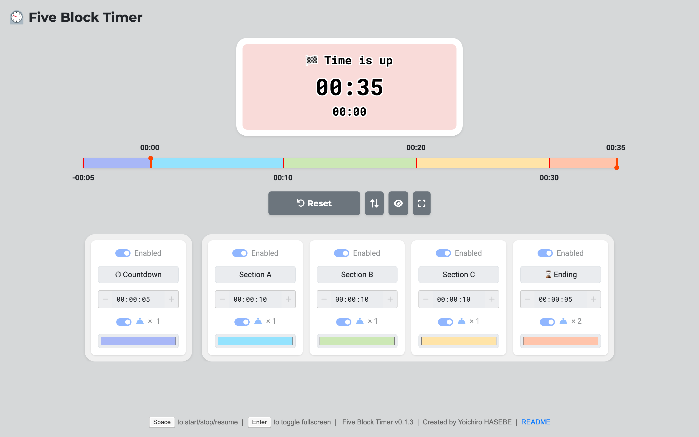
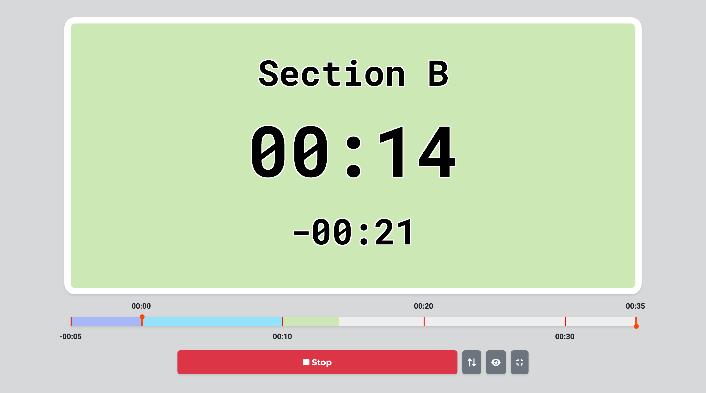

# Five Block Timer

Five Block Timer is a flexible and customizable web-based timer application designed to help users manage their time effectively. It allows for the creation of up to five distinct time blocks, making it ideal for various timing needs such as conference talks, exams, or productivity sessions.

[Five Block Timer Online](https://yohasebe.github.io/five-block-timer/)

## Features

- Visual **progress bar** with section markers
- Customizable **time blocks** with individual **labels** and **colors**
- **Responsive design** for desktop and mobile devices
- **Fullscreen mode** for better visibility
- **Keyboard shortcuts** for easy control
- Beautiful **SVG-based** timer display
- **Countdown feature** before main timer blocks
- Swap between **main timer** and **countdown display**
- **Sound notifications** at the end of each block

## Usage

**Setting up**

1. Set the duration for each time block using the settings panel.
2. Customize labels and colors for each section as needed.
3. Set the number of rings at the end of each block by clicking the bell icon.

**Using the Timer**

1. Click the "Start" button or press the spacebar to begin the timer.
2. Use the "Stop", "Reset", and "Resume" buttons as needed during timing.
3. Toggle the visibility of the sub-timer and swap between main and sub-timer displays using the provided buttons.

### Keyboard Shortcut

- **Spacebar**: Acts as a multi-function key
  - When the timer is not running: Starts the timer
  - When the timer is running: Stops the timer
  - When the timer is stopped: Resumes the timer
  - When the timer has finished: Resets the timer
- **Enter**: Toggles fullscreen mode

Note: The spacebar shortcut will not work when focus is on a text input field

## Installation

No installation is required. Simply access the [Five Block Timer](https://yohasebe.github.io/five-block-timer/) online to use the application.

## License

This project is open source and available under the [MIT License](LICENSE).

## Credits

- Timer icon: [SVG Repo](https://www.svgrepo.com/svg/407626/timer-clock) (MIT License)
- Bell sound: [Pixabay](https://pixabay.com/sound-effects/bell-98033/) (Pixabay License)
- Beep sound: [Pixabay](https://pixabay.com/sound-effects/start-13691/) (Pixabay License)

## Author

Yoichiro HASEBE [yohasebe@gmail.com]
